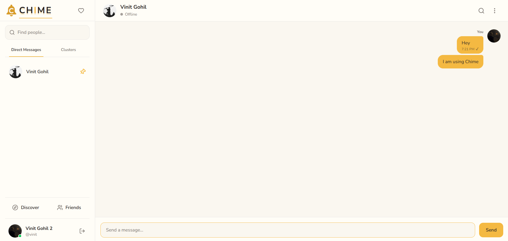
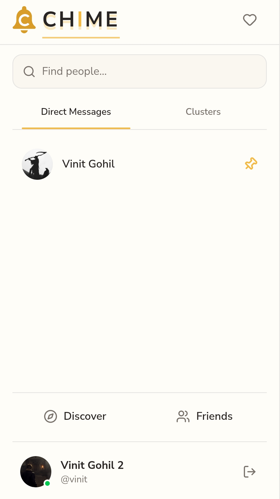

# 🔔 Chime

> A real-time communication platform built for fast, connected conversations.

**[Live Demo](https://chime-hazel.vercel.app/)**

---

## About

Chime is a full-stack real-time communication platform designed around instant messaging, live presence, and a clean app-like experience across desktop and mobile.

The core of Chime is its real-time architecture. Instead of relying on polling or page refreshes, supported changes are propagated through Socket.IO and reflected across connected clients immediately.

Chime also introduces **Clusters** — dedicated spaces for group conversations with support for both public and private access.

---

## Preview

### Desktop



### Mobile



---

## Features

- 💬 Real-time direct messaging
- 👥 Friend requests and friend management
- 🟡 Public and private Clusters
- 🟢 Online presence and status
- ⌨️ Typing indicators
- ✓ Message delivery and read states
- ↩️ Message replies
- ✏️ Message editing
- 🗑️ Message deletion
- 🔔 Real-time notifications
- 👤 User profiles and profile pictures
- 📱 Responsive, mobile app-like experience
- 🔐 JWT-based authentication and authorization

---

## Tech Stack

| Layer             | Technologies              |
| ----------------- | ------------------------- |
| Frontend          | React, Vite, Tailwind CSS |
| Routing           | React Router              |
| Backend           | Node.js, Express          |
| Real-time         | Socket.IO                 |
| Database          | MongoDB, Mongoose         |
| Caching / Scaling | Redis, Upstash            |
| Authentication    | JWT, bcrypt               |
| Media             | Cloudinary                |
| Deployment        | Vercel                    |
| UI                | Lucide React              |

---

## Architecture

Chime uses HTTP for conventional API operations and Socket.IO for persistent real-time communication.

```text
┌──────────────────────┐
│     React Client     │
│                      │
│ UI + Client State    │
└──────────┬───────────┘
           │
     HTTP + Socket.IO
           │
           ▼
┌──────────────────────┐
│    Express Server    │
│                      │
│ REST API + Socket.IO │
└─────────┬──────┬─────┘
          │      │
          │      ▼
          │  ┌──────────────┐
          │  │    Redis     │
          │  │              │
          │  │ Socket.IO    │
          │  │ Adapter      │
          │  └──────────────┘
          │
          ▼
┌──────────────────────┐
│       MongoDB        │
│                      │
│ Persistent Data      │
└──────────────────────┘
```

### Real-time flow

A typical message follows this flow:

```text
User sends message
        │
        ▼
Socket.IO event
        │
        ▼
Server validates request
        │
        ├──────────────► MongoDB
        │
        ▼
Socket.IO event
        │
        ▼
Recipient receives message
        │
        ▼
Client state updates
        │
        ▼
UI updates immediately
```

The same event-driven approach is used for other real-time functionality such as presence, typing indicators, read states, delivery states, friendship changes, notifications, and Cluster activity.

---

## Real-Time Design

Real-time behavior is a core requirement of Chime rather than an additional layer added later.

The application avoids periodic polling for supported live features. Instead, the server emits targeted Socket.IO events and clients update their local state in response.

This allows actions such as:

- Sending and receiving messages
- Presence changes
- Friend requests and responses
- Read and delivery state updates
- Typing indicators
- Notifications
- Cluster activity

to propagate without requiring a page refresh.

Redis and the Socket.IO adapter provide the infrastructure needed to coordinate real-time communication across server instances.

---

## Clusters

Clusters are Chime's group conversation system.

They support two access models:

### Public Clusters

Public Clusters can be discovered and joined directly by users.

### Private Clusters

Private Clusters are not publicly discoverable. Access is restricted to users who have been granted access through the Cluster's private access flow.

Both types use the same real-time messaging infrastructure while maintaining different access and discovery rules.

---

## Project Structure

```text
chime-chat-app/
│
├── frontend/
│   └── src/
│       ├── components/
│       ├── pages/
│       ├── layouts/
│       ├── context/
│       ├── hooks/
│       ├── services/
│       └── ...
│
├── backend/
│   ├── config/
│   ├── controllers/
│   ├── middleware/
│   ├── models/
│   ├── routes/
│   ├── socket/
│   └── ...
│
└── ...
```

The frontend separates reusable UI, pages, layouts, shared state, hooks, and service/API logic.

The backend separates routing, controllers, database models, middleware, configuration, and Socket.IO functionality.

---

## Authentication & Security

Chime uses JWT-based authentication for both HTTP requests and Socket.IO connections.

Authentication and security include:

- JWT authentication
- Password hashing with bcrypt
- Protected API routes
- Authenticated Socket.IO connections
- Server-side authorization
- Protected Cluster access
- Rate limiting
- Security headers
- CORS configuration
- Environment-based secrets

Authentication state is shared between the HTTP and real-time layers so connected clients can be associated with authenticated users.

---

## Engineering Highlights

### Event-driven state synchronization

Realtime events update client state directly instead of requiring a refresh or polling cycle.

### Authenticated WebSockets

Socket.IO connections are authenticated using JWTs before users can participate in protected real-time functionality.

### Redis-backed real-time infrastructure

The Socket.IO Redis adapter allows real-time events to be coordinated across server instances.

### Persistent messaging

Messages and application state are persisted in MongoDB while Socket.IO provides immediate communication between connected clients.

### Presence system

Chime maintains live user presence and supports status changes including invisible presence.

### Mobile-first interaction model

The mobile interface behaves more like an application than a compressed desktop website. Navigation, chat transitions, message composition, and scrolling are structured around mobile interaction.

---

## Getting Started

### Prerequisites

- Node.js
- npm
- MongoDB
- Redis
- Cloudinary account

### Clone

```bash
git clone https://github.com/vinit0749/chime-chat-app.git
cd chime-chat-app
```

### Install dependencies

Frontend:

```bash
cd frontend
npm install
```

Backend:

```bash
cd ../backend
npm install
```

### Environment variables

Create the required environment files for the frontend and backend.

Backend configuration includes values for services such as:

```env
MONGO_URI=
JWT_SECRET=
REDIS_URL=
CLOUDINARY_CLOUD_NAME=
CLOUDINARY_API_KEY=
CLOUDINARY_API_SECRET=
```

Frontend configuration may include:

```env
VITE_API_BASE_URL=
```

Use your own credentials and never commit secrets to the repository.

### Run locally

Start the backend:

```bash
cd backend
npm run dev
```

Then start the frontend in a separate terminal:

```bash
cd frontend
npm run dev
```

---

## Deployment

Chime is deployed on Vercel.

**Live application:** https://chime-hazel.vercel.app/

Production infrastructure:

- **Vercel** — application deployment
- **MongoDB Atlas** — database
- **Upstash Redis** — Redis infrastructure
- **Cloudinary** — profile image storage

---

## Author

**Vinit Gohil**

Full-Stack Web Developer

**GitHub:** [vinit0749](https://github.com/vinit0749)

**LinkedIn:** [Vinit Gohil](https://linkedin.com/in/vinit-gohil-a27663330)
